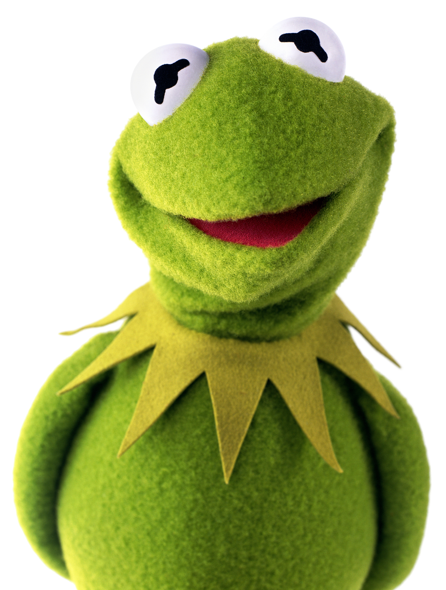
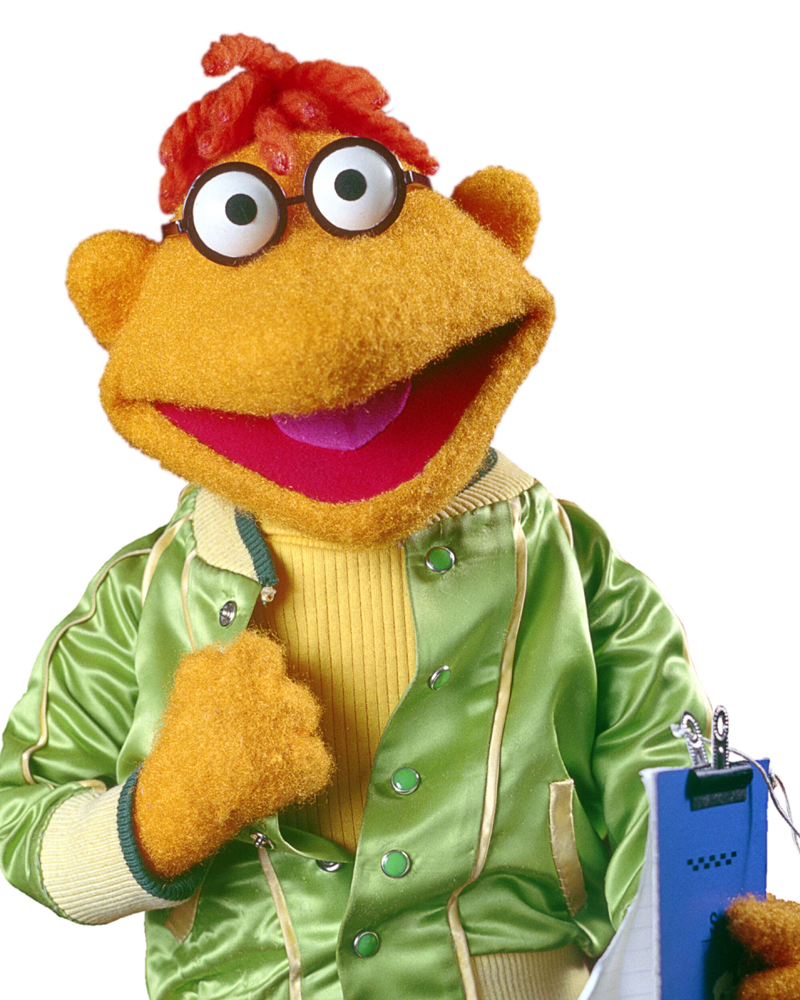

<!-- .slide: data-state="no-toc-progress" --> <!-- don't show toc progress bar on this slide -->

# Fika News

Din Löpsedel Fika

---

<!--## WROG
  

 **W**he**R**e is the w**O**rld **G**oing?-->

📰

### How do you read
## your News?

---

<!---->

<cite>"Who controls the media </cite>

<cite> controls the minds of the public” </cite>
  
Noam Chomsky

---

### Stop being fed by
## the media machine

---

# Goal

* Provide a less biased view on the news<!-- .element: class="fragment" -->

* Allow user to keep track of new stories<!-- .element: class="fragment" -->

---

### What some users say

---

I want to know what is going on

in the rest of the world

---

I'm tired of only negative news,

so I just stopped reading them :/

---

I like to keep following the developments of

news stories on cookies that I've been interested in

---

# How?

* Filtering news by sentiment <!-- .element: class="fragment" -->

* Filter bias by aggregating various sources <!-- .element: class="fragment" -->

* Tracking the evolution of news stories <!-- .element: class="fragment" -->

---

# Demo

---

<!-- .slide: data-background-iframe="http://localhost:8000/" -->
